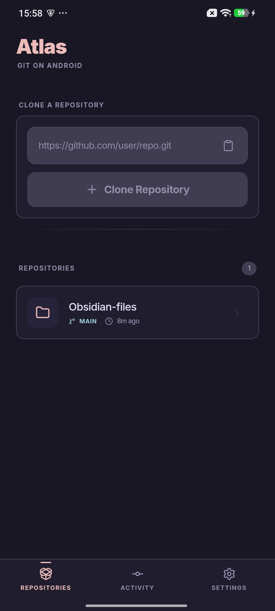
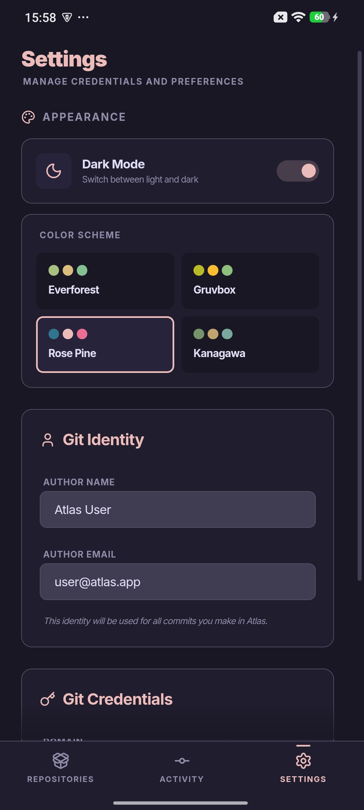
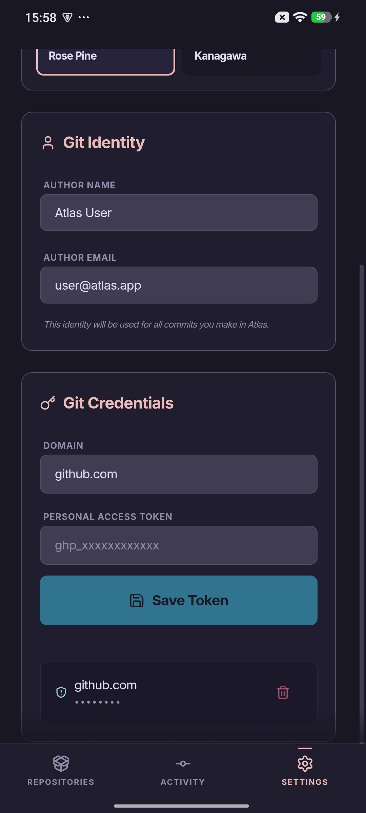
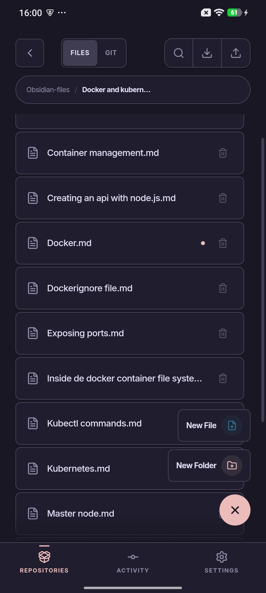
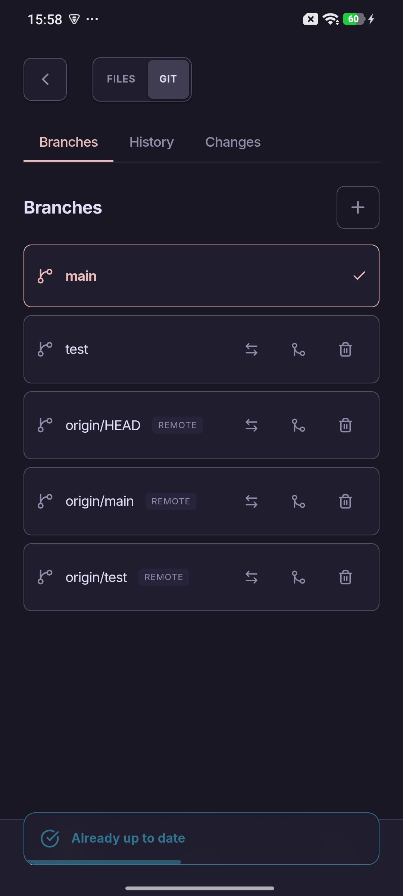
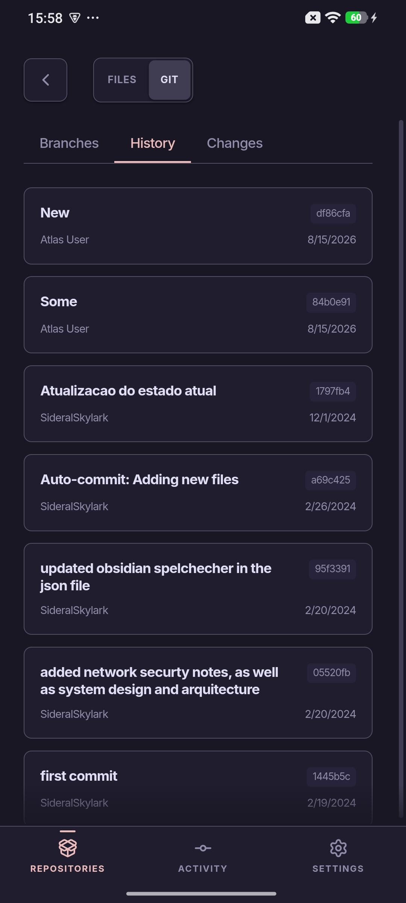
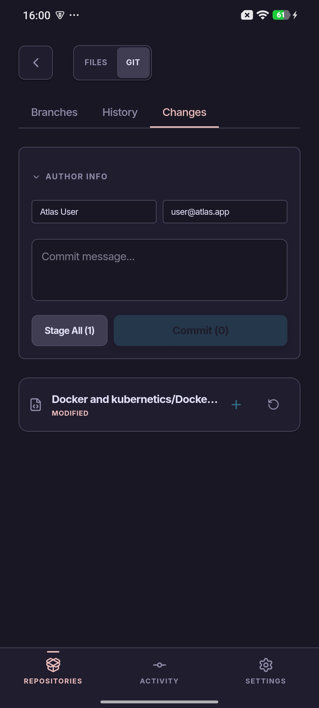
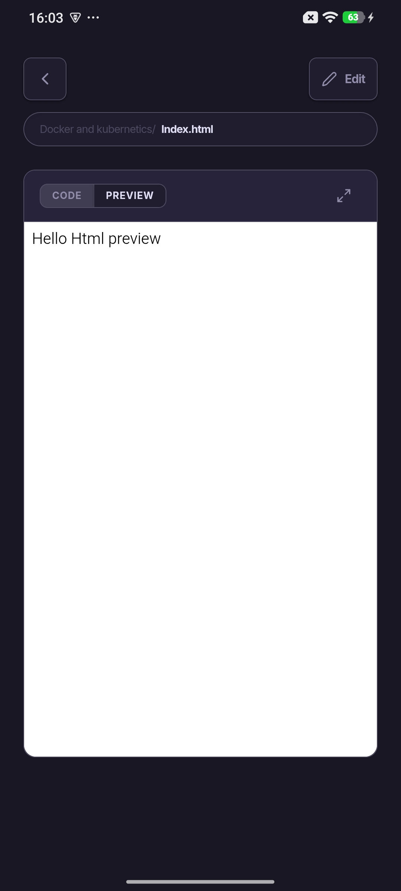

# Atlas — Project Specification
> A general-purpose Android Git client built with Tauri 2, Vue 3, and Rust.
> Open source. No accounts. No cloud. Just Git.

---

## Vision
Atlas is the Git client that doesn't exist on Android. It works with any remote —
GitHub, GitLab, Gitea, self-hosted — because it speaks Git directly. The other
devices in your workflow don't need Atlas. They just need Git.

---

## Screenshots

| Home | Settings | Settings (cont.) |
|---|---|---|
|  |  |  |
 
| Repo Files | Branches | Log |
|---|---|---|
|  |  |  |
 
| Commit | Markdown/HTML rendering |
|---|---|
|  |  |

---

## Tech Stack
| Layer               | Technology                       |
| ------------------- | --------------------------------- |
| Frontend            | Vue 3 + TypeScript (Vite)         |
| Backend             | Rust                              |
| Framework           | Tauri 2                           |
| Git                 | `git2` crate (libgit2 bindings)   |
| Syntax highlighting | `syntect`                         |
| Markdown rendering  | `pulldown-cmark`                  |
| Distribution        | F-Droid (primary), APK sideload   |

---

## Status
- **Git core (HTTPS):** clone, pull, push, branch, PAT auth — done
- **File rendering:** HTML/Markdown preview, syntax-highlighted code viewer, filename search — done
- **Security:** Android Keystore-backed PAT storage — done
- **Git workflow:** branches, commit history, staging, diffs, fast-forward merge — done
- **Editor:** create/edit/delete files, commit and push from editor — done
- **Theme:** 4 default themes with light and dark mode support — done
- **Build:** compiles and installs on-device; in manual testing phase

**Merge policy (v1):** fast-forward only. Non-fast-forward merges show an error
directing the user to resolve on desktop. No in-app conflict resolution.

---

## Remaining for v1
- [x] Fix stale-credential bug above
- [x] Fix duplicate safe-area bottom offset
- [x] Add inline "push branch" affordance right after branch creation, instead of
      requiring navigation to a separate page (workflow itself — create local,
      push separately — stays as-is; this is about surfacing the action, not
      changing the model)
- [x] Add "Commit & Push" as an option alongside "Commit" in the commit window
- [x] Mobile UI polish pass (touch targets, gestures)
- [ ] Performance pass on large repos / diffs
- [ ] F-Droid metadata and build recipe

---

## Architecture
```
Android Device
└── Atlas (Tauri 2)
    ├── Vue 3 frontend (WebView)
    │   ├── Repo list screen
    │   ├── File browser screen
    │   ├── File viewer screen
    │   ├── Git operations screen
    │   └── Editor screen
    └── Rust backend
        ├── git2 (clone, pull, push, branch, diff, log)
        ├── syntect (syntax highlighting)
        ├── pulldown-cmark (markdown)
        └── Android Keystore (credentials)
```

---

## File Storage
Repos are stored in private app storage:
```
/data/data/com.skylark.atlas/files/repos/
└── repo-name/
    └── (git repo contents)
```
Private storage is intentional — no external storage permissions needed,
no risk of other apps modifying repo state.

---

## Constraints & Principles
* **No accounts**: Atlas never talks to any Atlas server. It only talks to Git remotes.
* **Offline-first**: all operations except sync work without internet.
* **Open source**: MIT or Apache 2.0 license. F-Droid compatible.

---

## Future Work
Not planned for v1.
* SSH support (key generation/import, SSH clone/pull/push, host key verification, known_hosts management)
* Image & PDF viewer support
* Conflict resolution UI
* Visual history graph
* Blame view
* Global search across files (grep)
* Custom themes by the user
* App shortcuts (long-press to recent repos)
* Activity tab / global event feed
* Automated testing (Rust unit tests, Vue E2E)
* Commit amending

